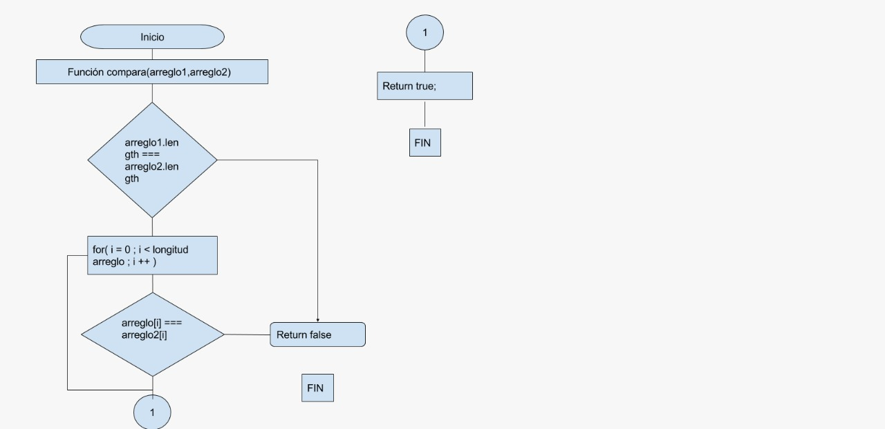

Pseudocódigo
1. Crear una funcion la cual reciba 2 arreglos como parametro
2. Comprobar si la longitus entre ellos es diferente
 2.1 si los arreglos no son iguales regresa falso
 2.2 si los arreglos son iguales continuar con el proceso
3. Comprobar uno a uno los elementos de los arreglos.
 3.1 si los arreglos no son igauales regresa falso
 3.2 si los arreglos son iguales continuamos comparando uno a uno
4. Si el paso tres se completa regresar true.
5. fin.

